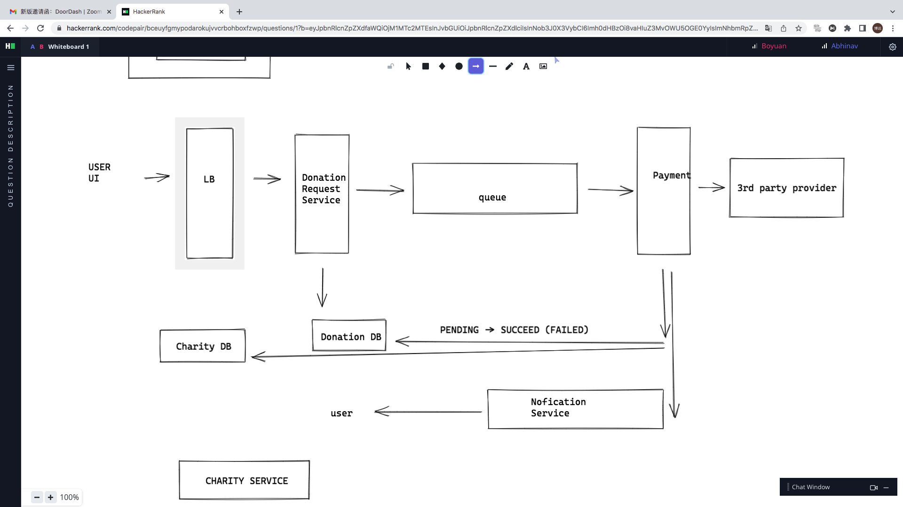

# System Design - Donation Service

CREATED 2022-09-20

DoorDash VIRTUAL ONSITE INTERVIEW IN 2022-09-22

SUMMARIZED 2022-11-07

## Functional Requirements

You are required to design a donation app for a 3 day charity event across the US where you are expecting 1 million donations.

Other aspects need to be confirmed, like:

Will the users need to login in (register an account before doing donation)?

What’s the user experience if the payment fails or succeeds? Will they received email or notification after a few minutes? - Important! This is related to sync or async workflow.

Can the user list/view/query their past donations?

Need the total donation money number of an event be up-to-date (updated in time)?

## Infra

The donation payment attempt and notification both happens asynchronously.

## Idempotency - Prevent Duplicate Donation

Idempotency key could be uuid generated by clients.

Also it could be hash value of (user + amount + hash(payment method)).

**Be Careful** - Whether the 3rd party payment can handle idempotency?

## Failure Tolerance

### Consistency - Data consistency across different micro-services

What if the [**Payment Attempt Service**] fails to tell [**Donation Service**] that the payment has succeeded? In this case the statuses can be inconsistent.

Also owns a Payment Attempt DB according to [**Payment Attempt Service**]. Using a cron job to determine inconsistency.

Leader node can fail and if that happens, one of the replicas will need to be promoted to be primary. Scenarios like split-brain should be prevented and replication lag should be monitored with metrics.

### Replicas

## Scaling

Split the traffic into multiple nodes.

DB partition - partition by directly userId or hash(userId), a range of hashes like consistent hashing.

## The Simple Infra Graph I draw During Interview

## Reference

[1] [Youtube - System design - donation app for a 3 day charity](https://www.youtube.com/watch?v=mNiHK_WK5KM)

[2] [System design for dummies — part 3 (Design a donation app)](https://chivagarg.medium.com/system-design-for-dummies-part-3-design-a-donation-app-c9f2720222ce)
