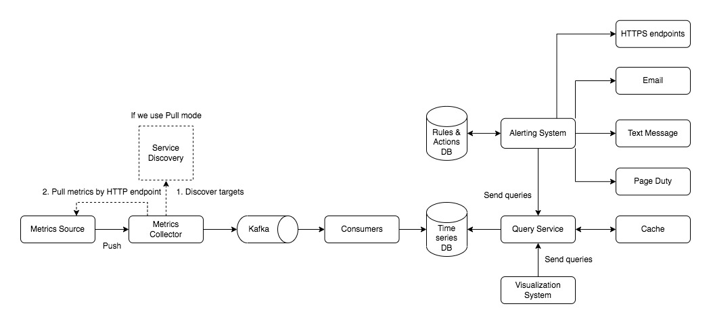
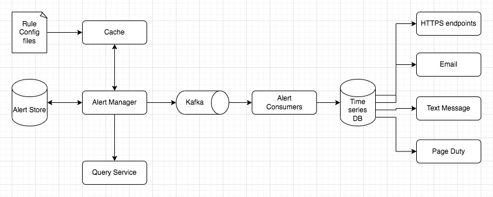

# System Design - Metrics Collecting System

CREATED 2022/01/14

REVISITED 2022/11/05

## Functional Requirements

For internal use only. System/operational metrics like latency, CPU usage, memory usage, disk usage, request count etc.

The write load is heavy. As you can see, there can be many time-series data points written at any moment.

There are millions of operational metrics written per day, and many metrics are collected at high frequency, so the traffic is undoubtedly write-heavy.

## Non-Functional Requirements

Scalability - scalable to accommodate growing metrics and alert volumes

Low latency - low latency when querying in dashboard

Reliability - avoid missing critical alerts

Flexibility - the pipeline should be flexible enough to integrate new technologies in the future

## Main Components

Data collection, data transmission, data storage, alerting and visualization.

### Data Model

**single point data value** - (domain, service/dimension name, metric name, timestamp, value, labels ...)

**time-series data points(list)** - a list of data points in a certain time of period, an array of <timestamp, value> pairs.

## Data Storage Choice

This system is heavy write load, while the read load is light.

### Relation DB (Considered but Discarded)

A general-purpose database, in theory, could support time-series data, but it would require expert-level tuning to make it work at our scale. Specifically, a relational database is not optimized for this solution. The complicated SQL is difficult to read.

### NoSQL (Considered but Discarded)

In theory, a few NoSQL databases on the market could handle time-series data effectively. Cassandra and BigTable can be both used for time series data. However, this would require deep knowledge to devise a scalable schema for effectively storing and querying time-series data.

### Better Choice - Time Series Database

**Time-series databases** are very commonly used for storing metrics data, like **InfluxDB and Prometheus**.

According to DB-engines, the two most popular time-series databases are InfluxDB and Prometheus, which are designed to store large volumes of time-series data and quickly perform real-time analysis on that data. Both of them primarily rely on an in-memory cache and on-disk storage. And they both handle durability and performance quite well. According to the benchmark, an InfluxDB with 8 cores and 32GB RAM can handle over 250,000 writes per second.

Another feature of a strong time-series database is efficient aggregation and analysis of a large amount of time-series data by labels(or tags).

## Infra Components

[**Metrics Source**] -> [**Metrics Collector**] -> [**Kafka Queue**] -> [**Data Consumers**] [**Time Series DB**] <-> [**Query Services**] <- [**Alerting System**] & [**Visualization System**]

[**Alerting System**] -> Email, Text Message, HTTPS endpoints.

### Metrics Source

This can be application servers, SQL databases, message queues, etc.

### Metrics Collector

It gathers metrics data and writes data into the time-series database.

**Pull Mode** - This needs to know the complete list of service endpoints to pull data from. Pull mode typically uses TCP.

Service discovery contains configuration rules about when and where to collect metrics from. Use a **consistent hashing** ring rule to ensure that one metrics source server is handled by only one metrics collector.

Steps:

1) The metrics collector fetches configuration metadata of service endpoints from Service Discovery. That will give us information about which services we have to monitor.

2) The metrics collector pulls metrics data via a pre-defined HTTP endpoint.

How to scale: We can have multiple monitoring collectors pulling the data from various servers (This can follow the consistent hashing rule) and then they push the data to the data center monitoring system.

Cons: It has to register a change event notification with Service Discovery to receive an update whenever the service endpoint changes. Also some jobs might be short-lived and don't last long enough to be pulled.

**Push Mode** - Send metrics directly to the metrics collector. The collection agent, installed on every server, aggregates metrics locally and sends them into metric collectors. They can hold a small buffer of data locally on disk if sending meets an error or exception. Push mode typically use UDP, which means the push mode provides lower-latency transports of metrics.

The metrics collector should be in an auto-scaling cluster with a load balancer in front of it.

Cons: It needs requiring authentication. Suitable for some short-lived jobs.

### Kafka (Optional, Better to have if using Push mode)

Kafka is used as a highly **reliable and scalable** distributed messaging platform.

It **decouples** the data collection and data processing services from each other.

It can easily prevent data loss by retaining the data in itself.

Scale: We can configure the number of partitions and partition metrics data by metric names, or labels & tags.

### Consumers

Consumers or streaming processing services such as Apache Storm, Flink and Spark, process and push data to the time-series database.

### Cache Layer (Optional)

Store the query results

### Time-series Database

This stores metrics data as time series. It usually provides a custom query interface for analyzing and summarizing a large amount of time-series data. It maintains indexes on labels to facilitate the fast lookup of time-series data by labels.

### Query Service

A cluster of query servers which takes the requests from clients(visualization and alerting systems).

### Altering System and Visualization System

Send alert notifications and show metrics in the form of graphs/charts.

Steps:

1) The alert system fetches alert configs from the cache or config files.

2) It calls the Query Service at a predefined interval. If the value violates the threshold, an alert event will be created. It also filters, merges and dedupe alerts.

3) It saves the alert event into Alert Store, which is a key-value database, such as Cassandra. And it also records the status of all alert events.

4) Alert event is inserted into Kafka.

5) Consumers pull alert events from Kafka and send notifications to different channels.

## Infra Graph

Metrics System

Alerting System

## Others

### When to do Aggregation

* the collection agent installed on the client-side

* ingestion pipeline - aggregate data before writing to the storage database

* query side - Raw data can be aggregated over a given time period during query. The query time can be very slow!

### Down-sampling

Retention: 7 days, no sampling. 30 days, down-sample to 1 minute resolution. 1 year, to 1 hour resolution.

Purpose: reduce the data size.

### Visualization

Visualization is built on top of the data layer. E.g. Grafana is a visualization tool for time series data.

A heat map is a data visualization technique that shows the magnitude of a phenomenon in two dimensions by using colors.

## Influx DB

InfluxDB is an open-source time series database (TSDB) developed by the company InfluxData. It is written in the Go programming language for storage and retrieval of time series data in fields such as operations monitoring, application metrics, Internet of Things sensor data, and real-time analytics.

## AresDB in Uber - <https://eng.uber.com/aresdb/>

TODO

## Important points Summarize

* Pull or Push model for collecting metrics data

* Use Kafka to scale the system

* Choose the right time-series database

## Ad Click Event Aggregation

Not only operational and business metrics, but also log files containing click events like (ad_id, timestamp, user_id, ip, location, etc).

Main use cases: 1) Aggregate the number of clicks of ad_id in the last M minutes. 2) Return top K most clicked ad_ids in the last M minutes. 3) Data filtering.

Non-functional requirements: Correctness, Handle delayed and duplicated messages properly, Robustness and Latency Requirement.

Use Cassandra to store both the raw data (read low, write heavy) and the aggregated data (read heavy, write heavy). Old raw data could be moved to **cold storage** and aggregated data could be served as active data.

Raw data: (ad_id, click_timestamp, user_id, ip, country, ...)

Aggregated data: (ad_id, click_minute, count, ...) and (timestamp_minute, most_clicked_ads)

Time: Event time & Processing time. Trade-off to decide which is used for aggregation. Prefer **event time** for more accuracy. We can use **watermark**, which is regarded as an extension of an aggregation window (extended wait time), to include the events with short delays in order to help improve accuracy.

Aggregation windows: We choose **tumbling window** (same length with non-overlapping) and **sliding window** (sliding across the data stream according to a specified interval).

Delivery guarantees of message queue: We recommend exactly-once delivery.

Avoid data duplication: We can record the offset by using external file storage (HDFS or S3). To avoid data loss, we need to save the offset once we get an ack back from downstream service.

Make several steps into a transaction box: Aggregator sends result to downstream service, ACK back from downstream service and Aggregator's saving offset to HDFS/s3. **A distribution transaction** is a transaction that works across several nodes. If any of the operations fails, the whole transaction is rolled back.

Monitoring: latency, message queue size.

Reconciliation: compares raw data database and aggregation database. The results may not exactly same match because some events might arrive late (with latency).

Another option is to store data in Hive with an ElasticSearch layer built on it for faster queries.

## Reference

[1] Copied from Alex Xu's posts in LinkedIn website

<https://www.linkedin.com/posts/alex-xu-a8131b11_systemdesign-coding-interviewtips-activity-6887071466156892160-uMs3>

<https://www.linkedin.com/feed/update/urn:li:activity:6887439575577432064>

<https://www.linkedin.com/posts/alex-xu-a8131b11_systemdesign-coding-interviewtips-activity-6887794567282860032-hX9-/>

[2] System Design Interview Book Volume II. Alex Xu. Chapter 5. Metrics Monitoring and Alerting System.

[3] <https://en.wikipedia.org/wiki/InfluxDB>

[4] <https://medium.com/analytics-vidhya/understanding-opentsdb-a-distributed-and-scalable-time-series-database-e4efc7a3dbb7>
