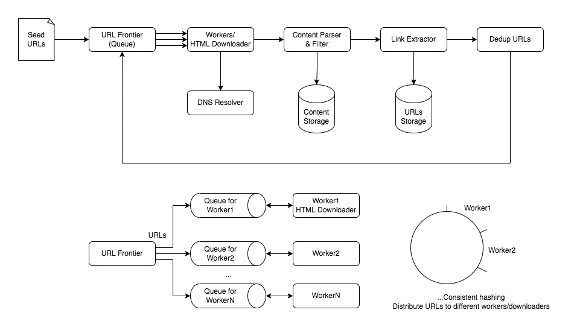

# System Design - Web Crawler

CREATED 2022/04/12

LAST UPDATED 2022/11/17

Keywords: multi-worker

## Introduction

A web crawler is an Internet bot that systematically scours the world wide web (WWW) for content, starting its operation from a pool of seed URLs. This process of acquiring content from the WWW is called crawling. It further saves the crawled content in the data stores. The process of efficiently saving data for subsequent use is called storing.

## Functional Requirements

Crawling - The system should scour the WWW, spanning from a queue of seed URLs.

Storing - The system should be able to extract and store the content of a URL in a blob store.

Scheduling - The system should have regular scheduling jobs to start crawling and storing.

## Common Questions

Use Case? Search engine index - A crawler collects web pages to create a local index for search engines. Search engines then can download all the pages to create an index on them to perform faster searches, like Reverse Index Service and Document Service. Another big use case is copyright detection.

Number of Total? 15 billion web pages per month.

Content type? HTML pages only. (Sound files, images and videos are not considered here)

Protocol - HTTP only.

Storage retention? Store up to five years.

Duplication? Duplicate pages should be ignored & discarded.

## Non-Functional Requirements

Scalability - distributed and multithreaded, efficient for parallelization

Consistency

Politeness - self-throttling and not crawling the same page during a certain amount of time

Extensibility - new functionality could be added to it and there could be newer media types in the future

## Estimation

Crawl speed = 15 billion / 30 / 86400 ~= 6000 pages/second

Download bandwidth = 6000 pages/second * (100 KB + 500 Bytes) ~= 600 MB/s

Storage estimation = 15 billion x (100 KB + 500 Bytes) = 1.5 PB

A web page has the average size of 100KB and 500 Bytes of metadata. => 1.5 TB per month and 90 PB for five years.

For 70% capacity model, we have 1.5 TB / 70% ~= 2.14 TB

## Workflows

The basic algorithm executed by any Web crawler is to take a list of seed URLs as its input and repeatedly execute the following steps.

* Pick a URL(Uniform Resource Locator) from the URL frontier’s queue and assigns it to the available worker.

* Determine the IP Address of its host-name by using DNS resolver.

* Establish a connection to the host to download the corresponding document.

* Parse the document HTML content and do URLs extraction.

* Do de-duplicate check to see if the same URLs have been crawled before (Use hashes or checksums). Also save the content into storage.

* Send the newly-discovered URLs to the scheduler.

* Go back to step one again to do the cycle re-crawling until the URL frontier queue is empty.

## Main Components

Scheduler - used to schedule crawling events on the URLs that are stored in its database

DNS Resolver - Map hostname to IP addresses for HTML content fetching

Cache - used in storing fetched documents for quick access by all the processing modules

Blob Storage - store the crawled content and visited URLs

## Infra Graph

[**Seed URLs**] -> [**URL Frontier**] -> [**HTML Downloader**] -> [**Content Parser**] -> [**Content Seen?**] ↓-> [**Content Storage**]

... -> [**Link Extractor**] -> [**URL Filter**] -> [**URL Seen?**] (loop back to **URL Frontier**)

Seed URLs - We can give some beginning URLs where we can start.

URL Frontier - FIFO queue, it also should prioritize which URLs remained to be crawled/downloaded. We can distribute our URL frontier into multiple servers and on each server we have multiple worker threads performing the crawling tasks. Front queue is maintained  by prioritizing and back queue is maintained by politeness selector, or we can replace the back queue with some type of rate limiters.

HTML Downloader/Fetcher - it needs DNS resolver to translate URL to IP address.

Content Parser - parses HTML pages and checks/validates if it is malformed.

Content Seen - checks if a HTML page/document is already stored/crawled before. Most are stored on disk (Content Storage) and the popular ones are in memory. We can calculate a 64-bit checksum/fingerprint (like MD5 or SHA) of every processed document and store it in a database. For every new document, we can compare its checksum to all the previously calculated checksums to see the document has been seen before. Checksum storage: 15 billion distinct web pages * 8 bytes => 120 GB, which can fit into a modern-day server’s memory.

Link Extractor - extracts links from HTML pages. It can have the extensibility where we can add image or video Downloader module (different media types) and Web Monitor module.

URL Filter - filter out pages with noise or ads only or few content, even spam pages. The customers can also provide some rules, disallow list. Also we can add a cache layer for websites with Robots exclusion.

URL Seen/URL De-dup - checks if a URL is already stored. The URL Storage keeps tracks of URLs already visited. Hash tables in-memory cache and URL disk storage are usually used. We could also maintain the checksums. If this URL has not been seen/visited before, pass it to URL Frontier. We keep an in-memory cache of **popular** URLs on each host shared by all threads.

## Algorithm

BFS - Breadth first search

We have to deal with two problems:

* Large volume of web pages - Download the same URL in parallel (avoid sending too many requests to the same hosting server in a short period of time, avoid making distributed denial-of-service (DDoS) attack), issue of lack of the priority/freshness.

* Rate of changes on web changes - By the time the crawler is downloading the last page from a site, the page may change.

### Distributed Crawling/Data Partition

What about the case of a distributed URL frontier?

My idea:

URL Frontier sends different URLs to different HTML Fetcher(Downloader) servers/machines by using a hash function (It can be consistent hashing: distributing URLs based on hostname). And each server can run multiple threads. Also there are Redis on each server maintaining the sorted sets and a queue. Also each worker thread will maintain its own separate sub-queue.

We want to make sure that at most one worker thread will download documents/content from a web server. And it will not overload the web servers.

Horizontal scaling - keep each servers/machines stateless.

### Timeout

We can set a timeout threshold (a maximal wait time) and keep an exponential back-off retry mechanism. After all failed we can stop and abandon that URL.

## Storage & Consistency

Our system consists of several crawling workers. And our system computes **the checksums of URLs and documents** and compares them with the existing checksums of the URLs and documents respectively. Also the system stores the checksums into storage.

## Politeness & RobotsExclusion

Check **Robots.txt** file first which is called Robots Exclusion Protocol, before attempting to crawling a website.

## Fault Tolerance

Since we are distributing URLs based on hostname to different hosts by using consistent hashing, we can store these data like URLs, checksum and content on the same host.

Each host will perform **checkpoint** periodically and dump a **snapshot** of all the data (mainly FIFO queues) it is holding onto a remote server. If a server goes down, another server can replace it and restore from the backup data.

## Follow Up

How to handle new updates in the already crawled URL? Compare the content and set a threshold (10% content diff).

DNS Resolver - DNS lookup can be a bottleneck and bandwidth should be kept enough to keep high throughput. We could cache the DNS results by building our own local DNS resolver and maintaining our own DNS cache.

Crawler Traps - A cycle of links cause a crawler to crawl infinitely in a specific domain, resulting in indefinite crawler resource exhaustion. Solutions for that: 1) Analyze the URL schemas. 2) Analyze the total number of web pages against a domain. If the crawling reaches the number of limit, stop crawling that domain and exit that web page.

How frequently does the crawler need to re-crawl? Do predictive analysis of the previous content changes. Like every 5 minutes for news websites.

Can we use DFS instead of BFS? - We can use DFS when we want to utilize a website’s persistent connection to traverse all the web pages on that specific domain. This saves time as it helps us avoid reconnecting with the same website repeatedly in case the session expires.

Extensibility - Adding a newer communication protocol module in the HTML fetcher (e.g. File Transfer Protocol (FTP) besides HTTP). Also we can extend to store the newly-extracted content including images and videos besides text.

## Reference

[1] System Design Interview Book. Alex Xu. Chapter 9. Design A Web Crawler.

[2] <https://roadtoarchitect.com/2019/04/01/design-web-crawler/>

[3] [如何设计网络爬虫系统？How to Design Web Crawler - System Design EP3 花花酱](https://www.youtube.com/watch?v=_NyVaxEIYGo)

[4] Design of a Web Crawler <https://www.educative.io/courses/grokking-modern-system-design-interview-for-engineers-managers>
